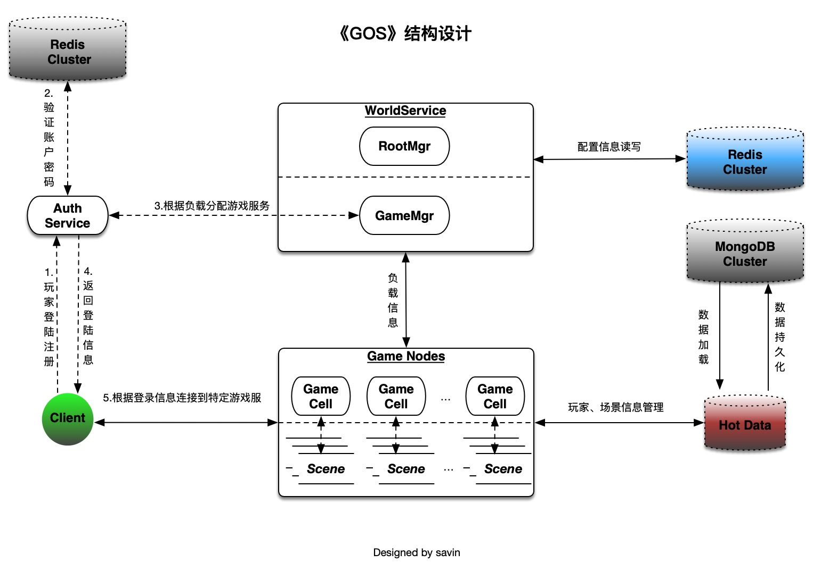

#项目状态
开发中

# 简介
《GOS》是一款基于Go语言的分布式游戏服务器框架，通过与k8s结合实现高可用、动态伸缩、在线扩容的特性，可应用于市面上绝大多数游戏类型：SLG、RPG、ARPG、MMO等。

## 结构图


## 结构详解
  * World(世界服务)
      - 职责:
        1. 提供账户注册、登陆
        2. 为玩家分配合适的游戏服务(Game)
      - 简介:
        1. k8s无状态集群服务
        2. 通过k8s提供一个无状态的service，提供集群内访问
  * Game(游戏服务)
      - 职责:
        1. 处理玩家请求，游戏逻辑的主要发生地
        2. 加载、持久化玩家、场景信息至数据库
        3. 广播管理：订阅、取消订阅
      - 简介:
        1. k8s有状态集群服务
        2. 每个Game对应一个k8s的Pod，服务于一个或多个场景

## 基础工具集
  * 分布式服务健康监测
  * GenServer：类似于Erlang的gen_server，封装了Groutine的基本启动、查找、消息同步/异步发送
  * 协议生成器：根据YAML生成客户端与服务器的通信协议
  * 路由管理：根据YAML文件生成路由协议，玩家请求自动分发至相应Controller进行处理
  * 热数据管理：按需加载玩家数据，并定时持久化至MySQL
  * MySQL管理：基于Rails的ActiveRecord进行migration管理，并生成Go的ORM文件
  * 定时任务：定时触发器，由redis持久化
  * 配置数据生成工具：解析excel表格生成对应的配置表
  * 排行榜服务：自定义各种排行榜，根据积分排名，可设置每个玩家自定义信息
  * 推送消息：苹果、谷歌(FCM)
  * 支付验证：苹果、谷歌

## Setup gos
```bash
git checkout https://github.com/mafei198/gos.git

# 安装依赖(go packages)
sh dep_install.sh

# 生成RPC通讯协议
cd goslib && protoc -I src/gos_rpc_proto --go_out=plugins=grpc:src/gos_rpc_proto src/gos_rpc_proto/*.proto

# 生成路由信息
cd generator && ./tools/gen_routes

# 生成通讯协议
cd generator && ./tools/gen_protocol

# 导出配置文件
cd generator && bundle exec rake generate_config

# 根据数据库表导出Model
cd generator && bundle exec rake generate_tables

# 编译游戏模块并打包成docker的image
make build_docker_images

# 将打包好的image上传到dockerhub(需要配置自己的docker账户进行推送)
make push_docker_images
```

## Setup k8s
```bash
#安装Helm
brew install kubernetes-helm

#部署Redis集群
kubectl apply -f k8s/deps/redis-cluster.yml
kubectl exec -it redis-cluster-0 -- redis-cli --cluster create --cluster-replicas 1 \
$(kubectl get pods -l app=redis-cluster -o jsonpath='{range.items[*]}{.status.podIP}:6379 ')

#部署MySQL
helm install stable/mysql --name single-mysql

#部署Ingress-nginx
helm install stable/nginx-ingress --name nginx-ingress

#部署游戏服务
kubectl apply -f dockers/k8s/depoyments/auth-service.yaml
kubectl apply -f dockers/k8s/depoyments/connect-service.yaml
kubectl apply -f dockers/k8s/depoyments/game-deployment.yaml
```

## TODO
  * 集成Vitess(MySQL集群) https://github.com/vitessio/vitess
  * 聊天服务
  * 邮件服务
  * 玩家日志
  * 云服务器管理
  * 运行时REPL交互环境
  
## FAQ
1.玩家在连接服务上的分配规则？
  - 分配规则：
    1. 直接将玩家分配到负载最低的连接服务
    
2.玩家在游戏服务上的分配规则？
  - 典型案例：根据游戏场景分布玩家
    1. MMO/SLG/RPG-场景：区服地图、跨服战地图
    2. MOBA/RTS/棋牌-场景: 区服大厅、对战房间
  - 内部处理逻辑：
    1. GameMgr根据玩家SceneId分配到对应Game的Scene

3.冷热数据如何管理？
  - 热数据类型有哪些？
    - 玩家热数据
      - 比如：玩家角色相关信息、个人信息
      - 玩家热数据随着玩家在服务间的迁移而迁移
    - 场景热数据
      - 比如：场景相关的信息
    - 世界热数据
      - 比如：排行榜、服务拓扑图
      
    注：
      1. 玩家、场景热数据由玩家当前所在场景管理
      2. 世界热数据由Redis托管
  - 冷热数据管理概述
    - HotData <-> RDS
    - HotData：玩家、场景、世界热数据
      - 职责：
        1. 热数据加载与定时回写，以及玩家下线回写
        2. 限制内存使用上限
        3. 使用LRU算法清理长时间未使用的玩家数据
      
    - RDS：冷数据存储
    - 关于RDS的选择: 首先根据在线玩家数量和玩家热数据持久化频率做预估，假设游戏有10w在线玩家，每个玩家平均隔5分钟进行一次数据存储，那么平均 TPS = 10w / 300s = 333

4.广播如何管理？
  主动订阅自己感兴趣的事件

5.定时任务在哪里进行处理？
  根据玩家SceneId，在对应场景处理
  
6.服务器间通信
  - RPC：
    - 技术选型：GRPC
    - 延迟不敏感、交互频率不高的场景
  - TCP：
    - 延迟敏感，交互频繁的场景


## License
GOS is under The MIT License (MIT)

Copyright (c) 2018-2028
Savin Max <mafei.198@gmail.com>

Permission is hereby granted, free of charge, to any person obtaining a copy
of this software and associated documentation files (the "Software"), to deal
in the Software without restriction, including without limitation the rights
to use, copy, modify, merge, publish, distribute, sublicense, and/or sell
copies of the Software, and to permit persons to whom the Software is
furnished to do so, subject to the following conditions:

The above copyright notice and this permission notice shall be included in all
copies or substantial portions of the Software.

THE SOFTWARE IS PROVIDED "AS IS", WITHOUT WARRANTY OF ANY KIND, EXPRESS OR
IMPLIED, INCLUDING BUT NOT LIMITED TO THE WARRANTIES OF MERCHANTABILITY,
FITNESS FOR A PARTICULAR PURPOSE AND NONINFRINGEMENT. IN NO EVENT SHALL THE
AUTHORS OR COPYRIGHT HOLDERS BE LIABLE FOR ANY CLAIM, DAMAGES OR OTHER
LIABILITY, WHETHER IN AN ACTION OF CONTRACT, TORT OR OTHERWISE, ARISING FROM,
OUT OF OR IN CONNECTION WITH THE SOFTWARE OR THE USE OR OTHER DEALINGS IN THE
SOFTWARE.

